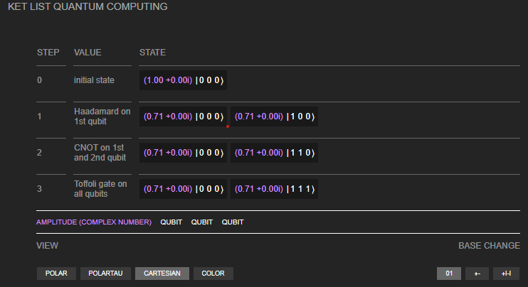
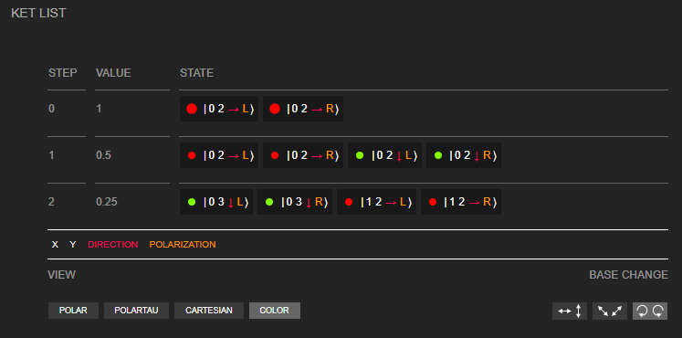
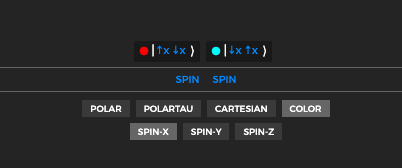
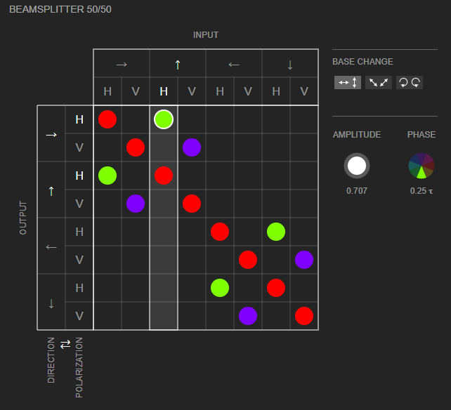
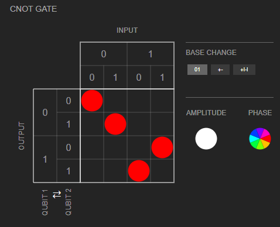
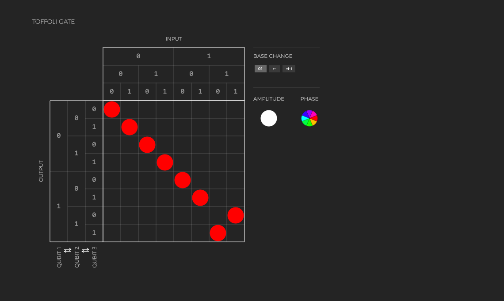

# bra-ket-vue / ⟨𝜑|𝜓⟩.vue

[](https://badge.fury.io/js/bra-ket-vue)

[](https://travis-ci.com/Quantum-Game/bra-ket-vue)
[](https://twitter.com/quantumgameio)

A visualizer for quantum states and matrices. In Vue.js.
See [live examples with code](https://codesandbox.io/s/bra-ket-vue-cydtt), or just [live examples](https://cydtt.csb.app/).

By [Piotr Migdał](https://p.migdal.pl/) (quantum physics & programming) and [Klem Jankiewicz](http://jankiewiczstudio.com/) (UX & design).

* Uses [Quantum Tensors](https://www.npmjs.com/package/quantum-tensors) library.
* A separated part of [Quantum Game 2](https://github.com/Quantum-Game/quantum-game-2) (developed at the [Centre for Quantum Technologies, National University of Sinagpore](https://www.quantumlah.org/)) we use it heavily.
* Founded by the [Unitary Fund](https://unitary.fund/).

[](http://unitary.fund)

## Installation

For a node project use:

```{bash}
npm install bra-ket-vue
```

or for yarn:

```{bash}
yarn add bra-ket-vue
```

For browser HTML files, put in `<head>...</head>`:

```{html}
<script src="https://cdn.jsdelivr.net/npm/vue"></script>
<script src="https://unpkg.com/quantum-tensors"></script>
<script src="https://unpkg.com/bra-ket-vue"></script>
```

Or if you want to stick to specific versions

```{html}
<script src="https://cdnjs.cloudflare.com/ajax/libs/vue/2.5.17/vue.js"></script>
<script src="https://unpkg.com/quantum-tensors@0.4.8/dist/quantum-tensors.min.js"></script>
<script src="https://unpkg.com/bra-ket-vue@0.3.1/dist/bra-ket-vue.min.js"></script>
```

For some applications you may want to read a bit about [Vue.js](https://vuejs.org/).

## Examples

Here are examples in the dark style. All components are available in two styles: dark and bright.
By default we use the dark style.
Each `vector` is a `Vector` object from Quantum Tensors, and each `operator` is an `Operator` object.

### States (vectors)





```{html}
<ket-viewer :vector="vector" :dark-mode="true" />
```



### Operators (matrices)

```{html}
<matrix-viewer :operator-raw="operator" :dark-mode="true" />
```







### Live examples with code

* NPM examples:
  * https://codesandbox.io/s/bra-ket-vue-cydtt - for a short overview
  * DARK color mode example: https://codesandbox.io/s/bra-ket-vue-dark-6zr46?fontsize=14&hidenavigation=1&theme=dark
  * BRIGHT color mode example: https://codesandbox.io/s/bra-ket-vue-dark-l88er?fontsize=14&hidenavigation=1&theme=dark
* A frontend JavaScript examples
  * <https://jsfiddle.net/user/stared/fiddles/>

* In-action:
  * [Quantum Game with Photons 2](https://quantumgame.io/), especially entries of the element encyclopedia (e.g. [Faraday rotator](https://quantumgame.io/info/faraday-rotator)).
  * Presentation with Reveal.js (RISE in Jupyter Notebook): <https://p.migdal.pl/piterpy-matrix/#/17>

## Notes

This repo was created using a script [vue-sfc-rollup](https://www.npmjs.com/package/vue-sfc-rollup)  (a Vue component library generator, for JavaScript and TypeScript).

For more, see [packaging Vue v2 Components for npm](https://vuejs.org/v2/cookbook/packaging-sfc-for-npm.html) in the official Vue documentation.
